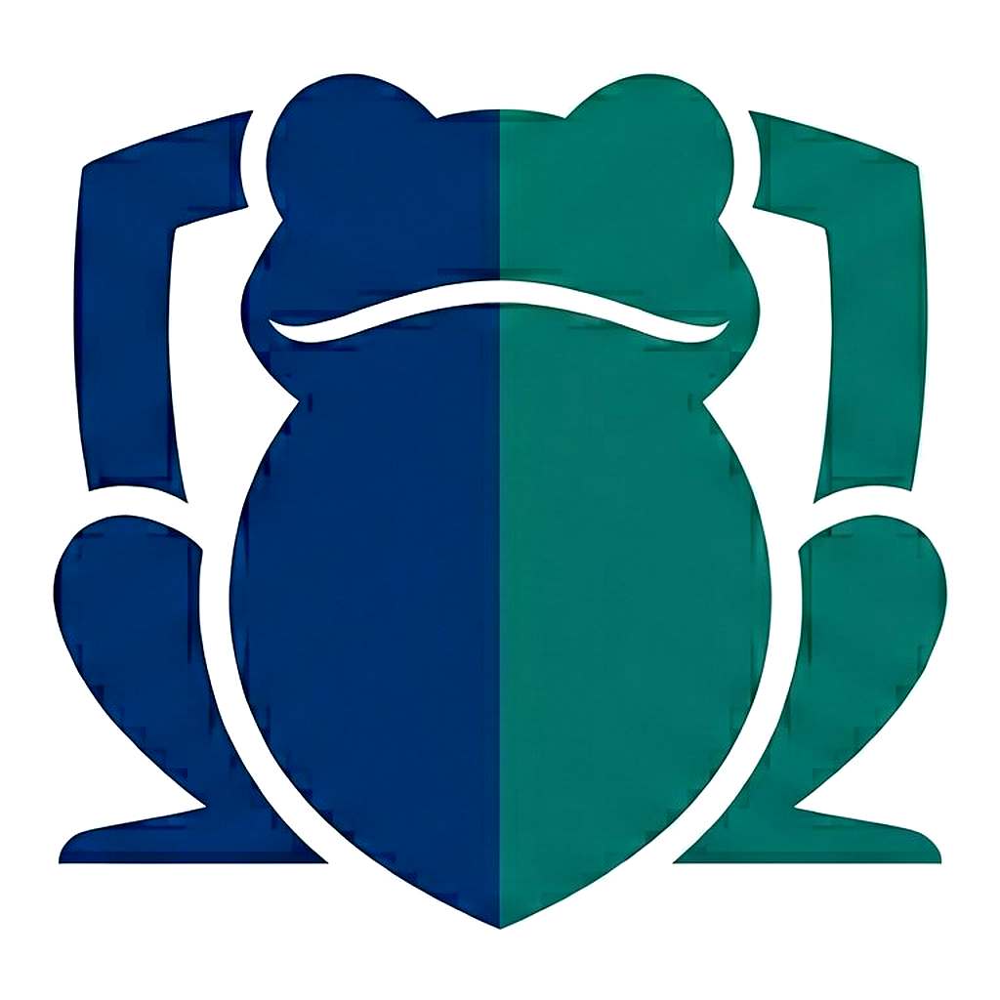

<div align="center">



# 🐸 ToAD - Active Directory Audit Platform

**Centralized platform for managing and generating Active Directory audits**

[](https://github.com/guigui45dela-star/ToAD/releases)
[](LICENSE)
[](https://www.docker.com/)
[](https://www.python.org/)
[](https://fastapi.tiangolo.com/)
[](http://makeapullrequest.com)

**[Français](README.md)** | **[English](README.en.md)**

[Installation](#-installation) • [Documentation](#-documentation) • [Contributing](#-contributing) • [Support](#-support)

</div>

---

## 📖 Table of Contents

- [Features](#-features)
- [Installation](#-installation)
- [Configuration](#-configuration)
- [Usage](#-usage)
- [Architecture](#-architecture)
- [Security](#-security)
- [Documentation](#-documentation)
- [Contributing](#-contributing)
- [Roadmap](#-roadmap)
- [Support](#-support)
- [License](#-license)
- [Acknowledgments](#-acknowledgments)

---

## 🎯 Features

- **Centralization**: All your PingCastle and AD-Miner reports in one place
- **Automated generation**: SharpHound upload → BloodHound → AD-Miner in one click
- **Multi-client**: Manage multiple clients with complete isolation
- **Modern interface**: Responsive dark theme UI, instant search
- **Integrated reminders**: Procedural guides for PingCastle, SharpHound, BloodHound
- **Optimized workflow**: Complete automation of the audit process

## 🚀 Quick Start

### Prerequisites

- Docker & Docker Compose
- BloodHound CE (included in docker-compose)
- AD-Miner (included in docker-compose)

### Installation

```bash
# 1. Clone the repository
git clone https://github.com/your-username/toad.git
cd toad

# 2. Configure environment variables
cp .env.example .env
nano .env  # Change passwords!

# 3. Launch the application
docker compose up -d

# 4. Access the interface
open http://localhost:9100
```

### Quick Usage

1. **Full audit** (recommended):
   - Fill out the "Full Audit" form
   - Upload PingCastle report (HTML)
   - Upload SharpHound ZIP
   - The application automatically handles: archiving, BloodHound import, ingestion wait, AD-Miner generation

2. **Unit actions**:
   - Create a client
   - Import PingCastle separately
   - Import SharpHound separately
   - Generate AD-Miner separately

## 📸 Screenshots

### Main Dashboard


### Client Actions


### Reminder Modal


## 🏗️ Architecture

```
┌─────────────────────────────────────────────────────────────┐
│                    ToAD (Web Portal)                         │
│  FastAPI Backend + SPA Frontend                              │
│  Port: 9100                                                  │
└──────────────┬──────────────────┬───────────────────────────┘
               │                  │
               ▼                  ▼
┌─────────────────────┐  ┌─────────────────────┐
│   BloodHound CE     │  │     Neo4j DB        │
│   (REST API)        │  │   (Bolt Protocol)   │
│   Port: 8080        │  │   Port: 7687        │
└─────────────────────┘  └─────────────────────┘
               │
               ▼
┌─────────────────────┐
│     AD-Miner        │
│  (Python CLI Tool)  │
└─────────────────────┘
```

## ⚙️ Configuration

### Environment Variables

See `.env.example` for the complete list.

**Main variables:**

```bash
# BloodHound
BLOODHOUND_URL=http://host.docker.internal:8080
BLOODHOUND_USERNAME=admin
BLOODHOUND_PASSWORD=your-secure-password

# Neo4j
NEO4J_URL=bolt://host.docker.internal:7687
NEO4J_USER=neo4j
NEO4J_PASSWORD=your-secure-password

# ToAD
TOAD_PORT=9100
INGEST_WAIT_SECONDS=30
```

### Customization

**Change listening port:**
```bash
TOAD_PORT=8080  # in .env
```

**Increase ingestion timeout:**
```bash
INGEST_WAIT_SECONDS=120  # for large files
```

## 🔒 Security

### Best Practices

1. **Change default passwords** in `.env`
2. **Don't expose ports publicly** without authentication
3. **Use a reverse proxy** (nginx, Traefik) with HTTPS
4. **Enable authentication** (see docs/security.md)
5. **Restrict network access** via firewall (iptables/ufw)

### Authentication

ToAD doesn't include native authentication by default. Options:

**Option 1: Basic Auth via nginx** (recommended)
```nginx
location / {
    auth_basic "ToAD Access";
    auth_basic_user_file /etc/nginx/.htpasswd;
    proxy_pass http://localhost:9100;
}
```

**Option 2: VPN access only**
- Deploy ToAD behind a VPN (WireGuard, OpenVPN)
- Restrict access to VPN users only

See [docs/security.md](docs/security.md) for more details.

## 📚 Documentation

- [Technical Architecture](docs/architecture.md)
- [Security Guide](docs/security.md)
- [Contributing Guide](CONTRIBUTING.md)
- [Changelog](CHANGELOG.md)

## 🛠️ Development

### Project Structure

```
toad/
├── docker-compose.yml      # Docker orchestration
├── .env.example            # Environment variables
├── web/
│   ├── app.py              # FastAPI Backend
│   └── index.html          # SPA Frontend
├── docs/                   # Documentation
└── scripts/                # Utility scripts
```

### Running in Development

```bash
# Backend (FastAPI)
cd web
uvicorn app:app --reload --host 0.0.0.0 --port 8000

# Frontend
# Open web/index.html in a browser
```

### Tests

```bash
# Run tests (to be implemented)
pytest tests/
```

## 🤝 Contributing

Contributions are welcome! See [CONTRIBUTING.md](CONTRIBUTING.md).

### Roadmap

- [ ] Integrated authentication (JWT/OAuth)
- [ ] PDF support for reports
- [ ] Tags and categories
- [ ] Cross-audit comparison
- [ ] Documented REST API (OpenAPI)
- [ ] Plugin system for new tools
- [ ] Azure AD / Entra ID support
- [ ] Multi-user with roles

## 📄 License

MIT License - See [LICENSE](LICENSE)

## 🙏 Acknowledgments

- [BloodHound CE](https://github.com/SpecterOps/BloodHound) - Specter Ops
- [AD-Miner](https://github.com/Mazars-Tech/AD_Miner) - Mazars
- [PingCastle](https://www.pingcastle.com/) - PingCastle
- [SharpHound](https://github.com/BloodHoundAD/SharpHound) - BloodHoundAD

## 📞 Support

- GitHub Issues: [Report a bug](https://github.com/your-username/toad/issues)
- Discussions: [Ask a question](https://github.com/your-username/toad/discussions)

---

**ToAD** - *Centralize your Active Directory audits*
